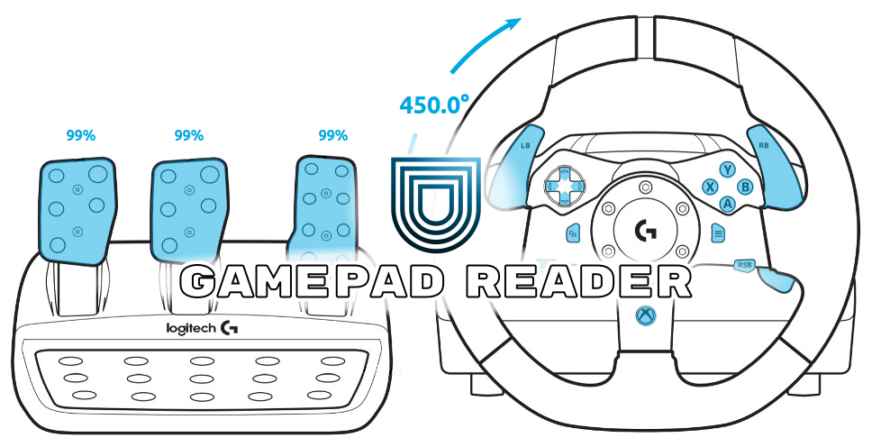

Gamepad reader for joysticks in windows and linux (if joystick driver is supported). This is a gamepad reader, it is configured to use Logitech Racing wheel G920 but you can modify it and use different joysticks.

___

## 1.1 Steps to setup the code in Windows:

  1. Download the development SDL library for Windows (it should be called SDL2-devel-2.*-mingw.tar.gz):
     [http://www.libsdl.org/download-2.0.php](http://www.libsdl.org/download-2.0.php)

  2. Open compressed file and copy the **content** of the folder:
     ```
     /x86_64-w64-mingw32/lib
     ```
     into (depends in the compiler path shown in **_Qt->tools->Options->Build_** & **_Run->Compilers_**):
     ```
     C:/Qt/Qt5.5.1/Tools/mingw492_32/lib
     ```
     
  3. Copy the folder:
     ```
     /x86_64-w64-mingw32/include/SDL2
     ```
     into (depends in the compiler path shown in **_Qt->tools->Options->Build_** & **_Run->Compilers_**):
     ```
     C:/Qt/Qt5.5.1/Tools/mingw492_32/include
     ```
     
  4. If you are using **x86_64-w64-mingw32** copy the **dll** file:
     ```
     /x86_64-w64-mingw32/bin/SDL2.dll
     ```
     into the folder where your **executable program** is _located_.
     
  5. Copy the **content** of the folder:
     ```
     /i686-w64-mingw32/lib
     ```
     into (depends in the compiler path shown in **_Qt->tools->Options->Build_** & **_Run->Compilers_**):
     ```
     C:/Qt/Qt5.5.1/Tools/mingw492_32/i686-w64-mingw32/lib
     ```
     
  6. Copy the folder:
     ```
     /i686-w64-mingw32/include/SDL2
     ```
     into (depends in the compiler path shown in **_Qt->tools->Options->Build_** & **_Run->Compilers_**):
     ```
     C:/Qt/Qt5.5.1/Tools/mingw492_32/i686-w64-mingw32/include
     ```
     
  7. If you are using **i686-w64-mingw32** copy the **dll** file:
     ```
     /i686-w64-mingw32/bin/SDL2.dll
     ```
     into the folder where your **executable program** is _located_.
     
     
  8. Compile the program.

  **NOTE:** If you copied the wrong .dll file in the step **4** or **7** the program may experience a __unexpected exit__, try copying the opposite .dll file into the folder where your executable is located.

  
## 1.2 Installing the Gamepad drivers in ubuntu
  
### 1.2.1 Installing xpad driver

  You need to check if the gamepad driver is already installed and running, write the following commands in an ubuntu terminal:
  
  ```shell
  sudo apt-get install joystick
  sudo apt-get install jstest-gtk
  ```
  
  Open jstest-gtk and see if the gamepad was detected, if not then, you will have to do all the steps until **1.3**:
  
1. Install xpad drivers:
  ```shell
  sudo apt-get install xserver-xorg-input-elographics
  sudo modprobe xpad
  ```
  
2. Adding **xpad** module to run from boot
   1. Open `/etc/modules´
     ```shell
     sudo gedit /etc/modules
     ```
   2. Add a new line with the text `xpad` and save file
  
### 1.2.2 Adding a mode switch

  Once you have the newest kernel installed, you can move on to the UDEV system and the usb_modeswitch updates.
    
  It's probably a good idea to start with the `usb_modeswitch`. You'll need to create a file in **/etc/usb\_modeswitch.d/** called `046d:c261`.

  ```shell
  sudo gedit /etc/usb_modeswitch.d/046d:c261
  ```

  Inside, dump the following:

  ```shell
  # Logitech G920 Racing Wheel
  DefaultVendor=046d
  DefaultProduct=c261
  MessageEndpoint=01
  ResponseEndpoint=01
  TargetClass=0x03
  MessageContent="0f00010142"
  ```

  The next step is to insert the following rule into udev. I stuffed mine into the rules file: **/lib/udev/rules.d/40-usb\_modeswitch.rules**, however you might want to try using the **/etc/udev/rules.d/** folder instead. If the latter doesn't work, the former certainly does... you just run the slight risk of future upgrades wreaking havoc when they get to this file.

  ```shell
  sudo gedit /lib/udev/rules.d/40-usb_modeswitch.rules
  ```

  and inside add the following before the last line `LABEL...`:

  ```shell
  # Logitech G920 Racing Wheel
  ATTR{idVendor}=="046d", ATTR{idProduct}=="c261", RUN+="usb_modeswitch '%b/%k'"
  ```

  or

  ```shell
  sudo gedit /etc/udev/rules.d/046d:c261
  ```

  and copy the same previous content. Restart your computer and now using `lsusb` in a terminal, the ID of the gamepad should have changed from `046d:c261` to `046d:c262`
  
  Restart the computer and your joystick should appear now in `jstest-gtk`
  
## 1.3 Steps to setup the code in Ubuntu:

  1. Install the following packages before installing SLD:
     ```
     sudo apt-get install build-essential xorg-dev libudev-dev libgl1-mesa-dev \
                   libglu1-mesa-dev libasound2-dev libpulse-dev libopenal-dev libogg-dev \
                   libvorbis-dev libaudiofile-dev libpng12-dev libfreetype6-dev libusb-dev \
                   libdbus-1-dev zlib1g-dev libdirectfb-dev
     ```
     
     **NOTE:** delete the name of the libraries that give you any problems when executing the previous command.
     

  2. Download the source code for SDL library (it should be called SDL2-2.\*.tar.gz or SDL2-2.\*.zip):
     [http://www.libsdl.org/download-2.0.php](http://www.libsdl.org/download-2.0.php)
     
  3. Uncompress the file, open the folder and run the following commands with ubuntu terminal set in that folder:
     ```
     ./configure
     make
     sudo make install
     make clean
     ```
  4. You can now delete the uncompressed folder to free memory.
  
  5. Don't forget to run:
     ```
     sudo ldconfig
     ```
     to update the necessary links and cache to the libraries.
     
## 2 How to use GamepadReader _class_
  
  There are two main member functions to use in **GamepadReader** class:
  
  1. Update gamepad data:
     ```cpp
     void GamepadReader::read_gamepad(const int index = -1);
     ```
     Which reads and updates the data in the detected gamepads, you should call this function at least once in each frame or cycle so, when you get the joystick values the data will be updated.

     If index >= 0 then, it will only update the `std::vector<GamepadData>`'s element width index = index, the __index__ must be inside this vector range.
  
     It is a `public slot` therefore, it could be called using **Signals** and **Slots** from **Qt**.
     
  2. Get all gamepads data:
     ```cpp
     const std::vector<GamepadData> *const get_gamepad_data();
     ```
     Which returns the address of all the values of the detected joysticks.

  3. Get a specific element inside the **GamepadData** vector:
     ```cpp
     const GamepadData *const get_gamepad_data(const int index);
     ```
     Which returns the address of the element with index = index from the vector: `std::vector<GamepadData> gamepads_;`

___
     
   ##### _Example of use_:
   ```cpp
   // Creates the object
   GamepadReader gamepad_;
   
   // Updates the joysticks data
   gamepad_.read_gamepad();
   
   // Get the clutch value from the first found Joystick
   double clutch = gamepad_.get_gamepad_data()->at(0).clutch;
   
   /* –––––––––––––––––––––––––––
     To update only one Gamepad
   –––––––––––––––––––––––––––––– */
   
   // Updates the Joystick element with index = 0
   gamepad_.read_gamepad(0);
   
   // Get the clutch value from the Joystick with index = 0
   double clutch = gamepad_.get_gamepad_data(0)->clutch;
   ```
  
#### 2.1 GamepadData structure:

  GamepadData is a `struct`from c++, the structure is the following:

  ```cpp
  struct GamepadData{
    //buttons:
    bool A     = false;
    bool B     = false;
    bool X     = false;
    bool Y     = false;
    bool RSB   = false;
    bool LSB   = false;
    bool RB    = false;
    bool LB    = false;
    bool back  = false;
    bool start = false;
    bool guide = false;
    //directional pad:
    bool up    = false;
    bool down  = false;
    bool left  = false;
    bool right = false;
    //steering: (angle in radians)
    double steering = 0;
    //pedals: (0 -> 1 : 0 = not pressed, 1 = maximum pressure)
    double clutch   = 0;
    double brake    = 0;
    double gas      = 0;
  };
  ```

## 3 Using CarMaker

If you want to use **GamepadReader** in **CarMaker** use the files inside the folder called _CARMAKER_. 

  1. Do the setup steps.
  
  2. You will need to modify _CMakeLists.txt_ and add **SOURCES** or **HPP_FILES**:
     ```
     #sources
     set(SOURCES
     #    CM_Main.cpp
     #    CM_Vehicle.cpp
     #    User.cpp
     #    app_tmp.cpp
     #    ADT/ADTMain.cpp
     #    ADT/CMUserOutput.cpp
         GamepadReader.cpp
     )
     
     ...
     
     set(HPP_FILES
     #  ADT/ADTMain.h
       GamepadReader.h
       definitions.h
     )
     ```
     
  3. Don't forget to modify the path to **CarMaker** and **Boost** directories:
     ```
     #carmaker
     #remember to change the carmake's directory
     set(CARMAKER_DIR C:/IPG/hil/win32-5.0.3)
     
     ...
     
     #boost
     #remember to change boost's directory
     set(BOOST_INC_DIR C:/boost_1_60_0)
     ```
     
### 3.1 Errors using SDL2 in CarMaker at Windows

  CarMaker is a wonderful b\*\*ch, sometimes it will throw an error related to SDL2 undefined references. This is because CarMaker could use a previous version of SDL2, to fix this you need to search for the file "_SDL2.dll_" inside the main directory of CarMaker; modify the name of the found file for "_SDL2\_old.dll_" and copy the new **SDL2.dll** file (from step _4_ or _7_ at section **1.1**) into the same directory.
  
  **REMEMBER THIS STEP**; you may need to change the name of "_SDL2\_old.dll_" back to "_SDL2.dll_" in the future for other compiled programs.
  
